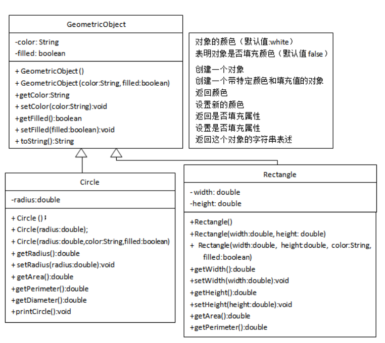
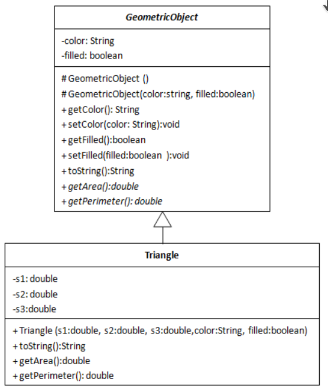
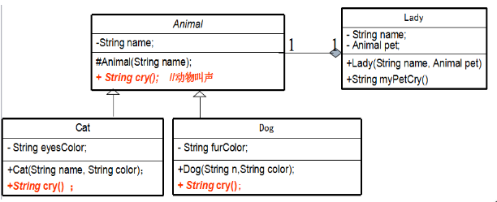
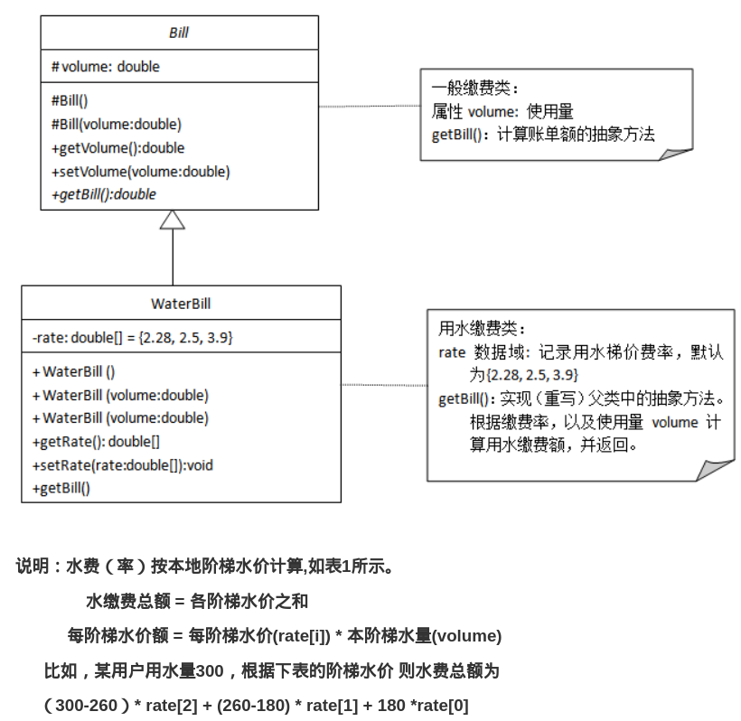
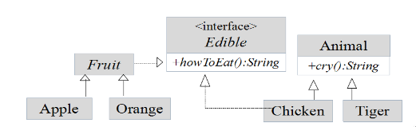
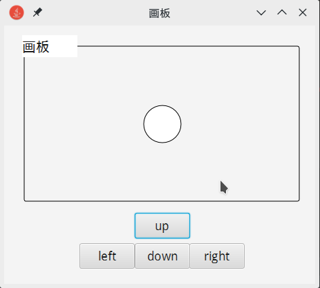
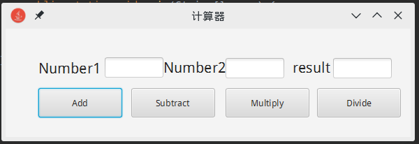

# Java-examples
My java homework (include java and javafx ) O W O
**java类与对象，接口与继承，以及图形界面练习。(从入门到入门)**

- **1-2 类与对象**
1.计算任意点（x,y）到原点的距离;
2.关于矩形类方法（长宽，面积，周长）;

- **3-9 继承与接口**
3.根据几何类实现圆与矩形的方法;

4.几何类实现三角形类;

5.根据UML图编写程序;

6.根据UML图编写程序;

7.随机输入数组，正方形边长，计算面积与排序;
8.根据UML图编写程序;

9.课程，与学生，与选课，退选;

- **10-11实验内容进阶（x）**
10.实验一（类与对象）简易银行，简单学生系统;
11.实验二（图形界面）面板上的小球移动，简易计算器

